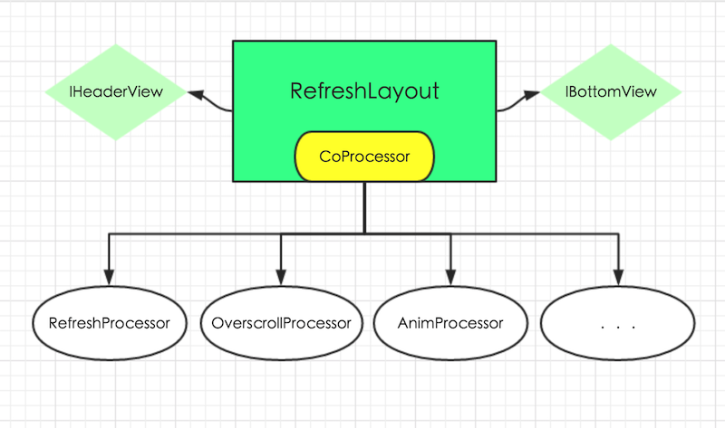
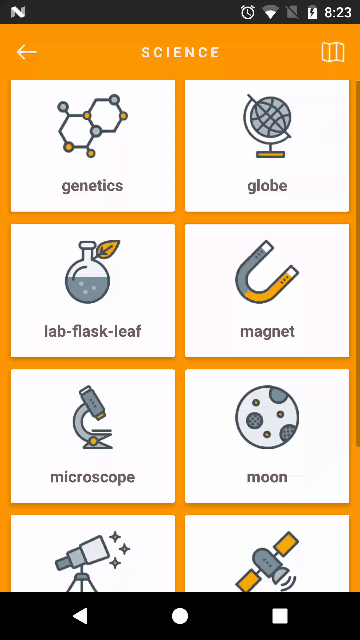
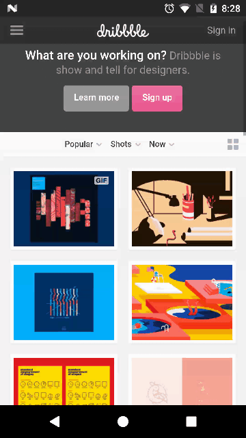

# TwinklingRefreshLayout
[中文文档](./README_CN.md)

TwinklingRefreshLayout extended the thoughts of SwipeRefreshLayout,using a ViewGroup to include a list of Views, to maintain its low coupling and high versatility. Follows are its main features.

 - New overscroll animations, running smoothly, much better than iOS.
 - Support RecyclerView, ScrollView, AbsListView, WebView and so on.
 - Support to load more.
 - Default support cross-border rebound.
 - You can open a pure bounds rebound mode.
 -  Lots of methods in the class OnRefreshListener.
 - It provides an interface to the callback during the sliding coefficient. Personalized offer good support.
 - NestedScroll,CoordinatorLayout
 
 **Any View is supported.**



## Demo
[Download Demo](art/app-debug.apk)

        

You can download these Videos for more details.

- [Music - ListView - FixedHeader](art/gif_listview.mp4)
- [Food - RecyclerView - PureScrollMode](art/gif_recyclerview.mp4)
- [Science - GridView - SinaHeader](art/gif_gridview.mp4)
- [Photo - RecyclerView - BezierLayout](art/gif_recyclerview2.mp4)
- [Story - ScrollView - GoogleDotView](art/gif_scrollview.mp4)
- [Dribbble - WebView - FloatRefresh](art/gif_webview.mp4)

## Usage
#### 1.Add a gradle dependency.
```
compile 'com.lcodecorex:tkrefreshlayout:1.0.7'
```

#### 2.Add TwinklingRefreshLayout in the layout xml.
```xml
<?xml version="1.0" encoding="utf-8"?>
<com.lcodecore.tkrefreshlayout.TwinklingRefreshLayout xmlns:android="http://schemas.android.com/apk/res/android"
    xmlns:app="http://schemas.android.com/apk/res-auto"
    android:id="@+id/refreshLayout"
    android:layout_width="match_parent"
    android:layout_height="match_parent"
    app:tr_wave_height="180dp"
    app:tr_head_height="100dp">

    <android.support.v7.widget.RecyclerView
        android:id="@+id/recyclerview"
        android:layout_width="match_parent"
        android:layout_height="match_parent"
        android:overScrollMode="never"
        android:background="#fff" />
</com.lcodecore.library.TwinklingRefreshLayout>
```

To get better effect, you'd better add code `android:overScrollMode="never"` to the childView.

#### 3.Coding in the Activity or Fragment.
##### Change of state need to be manually controlled.
```java
refreshLayout.setOnRefreshListener(new RefreshListenerAdapter(){
            @Override
            public void onRefresh(final TwinklingRefreshLayout refreshLayout) {
                new Handler().postDelayed(new Runnable() {
                    @Override
                    public void run() {
                        refreshLayout.finishRefreshing();
                    }
                },2000);
            }

            @Override
            public void onLoadMore(final TwinklingRefreshLayout refreshLayout) {
                new Handler().postDelayed(new Runnable() {
                    @Override
                    public void run() {
                        refreshLayout.finishLoadmore();
                    }
                },2000);
            }
        });
    }
```

Use finishRefreshing() method to end refresh, finishLoadmore() method to end load more. OnRefreshListener there are other methods, you can choose need to override.

And if you want you refresh automatically, call the method startRefresh().

##### setWaveHeight、setHeaderHeight、setBottomHeight、setOverScrollHeight
- setMaxHeadHeight is used To set the maximum height of the head can be stretched.
- setHeaderHeight is used to set the standard head height.
- setMaxBottomHeight.
- setBottomHeight is used to set the Bottom height.
- setOverScrollHeight is used to set the max height of overscroll.

And now dp value is supported.

#### setEnableRefresh、setEnableLoadmore
Flexible settings for whether to disable the pulling-down mode.

##### setHeaderView(IHeaderView headerView)、setBottomView(IBottomView bottomView)

#### setEnableOverScroll
Whether to allow overscroll mode, opened by default.

##### setOverScrollTopShow、setOverScrollBottomShow、setOverScrollRefreshShow
Whether to allow the display refresh control on overscrolling, the default is true.

##### setPureScrollModeOn()
To open the pure overscroll mode so that refreshView would gone permanently.

##### setAutoLoadMore
if open the loadmore mode after overscrolling bottom automatically.

##### addFixedExHeader
Allow you to add a view fixed on the top.

##### startRefresh、startLoadMore、finishRefreshing、finishLoadmore

##### setFloatRefresh(boolean)
Make refresh-animation like SwipeRefreshLayout.

##### setTargetView(View view)
Set the target view that you can scroll.

##### setDefaultHeader、setDefaultFooter
static methods aims to set a default header/footer in a/an Application/Activity.

#### 4.Attributes
- tr_max_head_height - Flexible head height
- tr_head_height -  Head height
- tr_max_bottom_height
- tr_bottom_height - Bottom height
- tr_overscroll_height - OverScroll Height
- tr_enable_refresh - default is true
- tr_enable_loadmore - default is true
- tr_pureScrollMode_on - default is false
- tr_overscroll_top_show - default is true
- tr_overscroll_bottom_show - default is true
- tr_enable_overscroll - default is true.
- tr_floatRefresh - open the float-refresh mode.
- tr_autoLoadMore
- tr_enable_keepIView - default is true.
- tr_showRefreshingWhenOverScroll - default is true.
- tr_showLoadingWhenOverScroll - default is true.

## Other
### 1.setOnRefreshListener
- onPullingDown(TwinklingRefreshLayout refreshLayout, float fraction)  
- onPullingUp(TwinklingRefreshLayout refreshLayout, float fraction)    
- onPullDownReleasing(TwinklingRefreshLayout refreshLayout, float fraction)  
- onPullUpReleasing(TwinklingRefreshLayout refreshLayout, float fraction)  
- onRefresh(TwinklingRefreshLayout refreshLayout)  
- onLoadMore(TwinklingRefreshLayout refreshLayout)  

fraction = currentMoveHeight/headHeight OR (fraction = currentMoveHeight/bottomHeight).

### 3.Header and Footer
##### BezierLayout(pic 4)
- setWaveColor
- setRippleColor

##### GoogleDotView(pic 5)
##### SinaRefreshView(pic 3)
- setArrowResource
- setTextColor
- setPullDownStr
- setReleaseRefreshStr
- setRefreshingStr

##### ProgressLayout(SwipeRefreshLayout pic 6)
- setProgressBackgroundColorSchemeResource(@ColorRes int colorRes)
- setProgressBackgroundColorSchemeColor(@ColorInt int color)
- setColorSchemeResources(@ColorRes int... colorResIds)

####Footer
##### BallPulseView(pic 2)
- setNormalColor(@ColorInt int color)
- setAnimatingColor(@ColorInt int color)

##### LoadingView(pic 3)
Here is more animations.[AVLoadingIndicatorView](https://github.com/81813780/AVLoadingIndicatorView)。

### 3.Personalize the Header and Footer.
The Header needs to implement IHeaderView interface and Footer in in the same way(IBottomView).
```java
public interface IHeaderView {
    View getView();

    void onPullingDown(float fraction,float maxHeadHeight,float headHeight);

    void onPullReleasing(float fraction,float maxHeadHeight,float headHeight);

    void startAnim(float maxHeadHeight,float headHeight);

    void reset();
}
```

getView() method is not allow to return null.

#### Let's implement a simple refresh dynamic efficiency.
1.Define SinaRefreshHeader extended from FrameLayout and implement IHeaderView interface.

2.Return this in the method getView().

3.Inflate and find Views in the layout xml.

```java
void init() {
        if (rootView == null) {
            rootView = View.inflate(getContext(), R.layout.view_sinaheader, null);
            refreshArrow = (ImageView) rootView.findViewById(R.id.iv_arrow);
            refreshTextView = (TextView) rootView.findViewById(R.id.tv);
            loadingView = (ImageView) rootView.findViewById(R.id.iv_loading);
            addView(rootView);
        }
    }
```

4.Override some methods.
```java
@Override
    public void onPullingDown(float fraction, float maxHeadHeight, float headHeight) {
        if (fraction < 1f) refreshTextView.setText(pullDownStr);
        if (fraction > 1f) refreshTextView.setText(releaseRefreshStr);
        refreshArrow.setRotation(fraction * headHeight / maxHeadHeight * 180);


    }

    @Override
    public void onPullReleasing(float fraction, float maxHeadHeight, float headHeight) {
        if (fraction < 1f) {
            refreshTextView.setText(pullDownStr);
            refreshArrow.setRotation(fraction * headHeight / maxHeadHeight * 180);
            if (refreshArrow.getVisibility() == GONE) {
                refreshArrow.setVisibility(VISIBLE);
                loadingView.setVisibility(GONE);
            }
        }
    }

    @Override
    public void startAnim(float maxHeadHeight, float headHeight) {
        refreshTextView.setText(refreshingStr);
        refreshArrow.setVisibility(GONE);
        loadingView.setVisibility(VISIBLE);
    }

    @Override
    public void onFinish(OnAnimEndListener listener) {
    listener.onAnimEnd();
    }
```

5.layout xml.
```xml
<?xml version="1.0" encoding="utf-8"?>
<LinearLayout xmlns:android="http://schemas.android.com/apk/res/android"
    android:orientation="horizontal" android:layout_width="match_parent"
    android:layout_height="match_parent"
    android:gravity="center">
    <ImageView
        android:id="@+id/iv_arrow"
        android:layout_width="24dp"
        android:layout_height="24dp"
        android:src="@drawable/ic_arrow"/>

    <ImageView
        android:id="@+id/iv_loading"
        android:visibility="gone"
        android:layout_width="34dp"
        android:layout_height="34dp"
        android:src="@drawable/anim_loading_view"/>

    <TextView
        android:id="@+id/tv"
        android:layout_width="wrap_content"
        android:layout_height="wrap_content"
        android:layout_marginLeft="16dp"
        android:textSize="16sp"
        android:text="pull down to refresh"/>
</LinearLayout>
```

Pay attention to the using of the parameter `fraction`. Such as the code above`refreshArrow.setRotation(fraction * headHeight / maxHeadHeight * 180)`，`fraction * headHeight` is the translationY of the Head and 180 is the angle the arrow would rotate，so that we can make the arrow rotate 180 degrees when the translationY is come to the maxHeadHeight.


onPullingDown/onPullingUp
onPullReleasing
startAnim - be called automatically after the method onRefresh/onLoadMore is called.

Congratulations! Simple to use and simple to Personalise.（To see a more simple example. **TextHeaderView(pic 4)**）。

### NestedScroll
#### TwinklingRefreshLayout Nested CoordinatorLayout
---layout
```xml
<?xml version="1.0" encoding="utf-8"?>
<com.lcodecore.tkrefreshlayout.TwinklingRefreshLayout xmlns:android="http://schemas.android.com/apk/res/android"
    xmlns:app="http://schemas.android.com/apk/res-auto"
    android:id="@+id/refresh"
    android:layout_width="match_parent"
    android:layout_height="match_parent">

    <android.support.design.widget.CoordinatorLayout
        android:id="@+id/coord_container"
        android:layout_width="match_parent"
        android:layout_height="match_parent"
        android:addStatesFromChildren="true"
        android:fitsSystemWindows="true">

        <android.support.design.widget.AppBarLayout
            android:id="@+id/appbar_layout"
            android:layout_width="match_parent"
            android:layout_height="wrap_content"
            android:clipChildren="false">

            <!--...-->

        </android.support.design.widget.AppBarLayout>

        <android.support.v7.widget.RecyclerView
            android:id="@+id/recyclerview"
            android:layout_width="match_parent"
            android:layout_height="match_parent"
            app:layout_behavior="@string/appbar_scrolling_view_behavior" />

    </android.support.design.widget.CoordinatorLayout>
</com.lcodecore.tkrefreshlayout.TwinklingRefreshLayout>
```

--- code1
```
refreshLayout.setTargetView(rv);
```
Find the RecyclerView/ListView.

--- code2
```java
AppBarLayout appBarLayout = (AppBarLayout) findViewById(R.id.appbar_layout);
appBarLayout.addOnOffsetChangedListener(new AppBarLayout.OnOffsetChangedListener() {
    @Override
    public void onOffsetChanged(AppBarLayout appBarLayout, int verticalOffset) {
        if (verticalOffset >= 0) {
            refreshLayout.setEnableRefresh(true);
            refreshLayout.setEnableOverScroll(false);
        } else {
            refreshLayout.setEnableRefresh(false);
            refreshLayout.setEnableOverScroll(false);
        }
    }
});
```

####CoordinatorLayout nested TwinklingRefreshLayout
--- layout
```xml
<?xml version="1.0" encoding="utf-8"?>
<android.support.design.widget.CoordinatorLayout xmlns:android="http://schemas.android.com/apk/res/android"
    xmlns:app="http://schemas.android.com/apk/res-auto"
    android:id="@+id/coord_container"
    android:layout_width="match_parent"
    android:layout_height="match_parent"
    android:addStatesFromChildren="true"
    android:fitsSystemWindows="true">

    <com.lcodecore.tkrefreshlayout.TwinklingRefreshLayout
        android:id="@+id/refresh"
        android:layout_width="match_parent"
        android:layout_height="match_parent"
        app:layout_behavior="@string/appbar_scrolling_view_behavior">

        <android.support.v7.widget.RecyclerView
            android:id="@+id/recyclerview"
            android:layout_width="match_parent"
            android:layout_height="match_parent" />

    </com.lcodecore.tkrefreshlayout.TwinklingRefreshLayout>

</android.support.design.widget.CoordinatorLayout>
```
Pay attention to `layout_behavior="@string/appbar_scrolling_view_behavior"` for TwinklingRefreshLayout.


## Update Logs
#### v1.07
- NestedScroll,CoordinateLayout
- Any View
- Keep state when refreshing/loading.

#### v1.06
- Repair memory leaks of customized Views.
- remove the dependence of AVLoadingIndicatorView.
- Fix bugs of OverScroll when TargetView scrolls at the top/bottom.
- Repair bugs of touching,scroll-event listeners.
- Optimization of interface flicker problems after load-more.

#### v1.05 Emergency Fix
- Fix the bug of setAutoLoadMore().
- Fix the bug that FixedHeader covered the first item of listview.
- Add onRefreshCanceled()/onLoadmoreCanceled() for RefreshListenerAdapter.

#### v1.04
- Refactor the code.
- Make animations smoothly.
- Add support to Fixed Header.
- Add support to float refresh mode.
- IHeadView.onFinish(animEndListener) -> Available to run animations before finishRefresh.

#### v1.03
- more attributes.
- Fix the NullPointerException bug in Fragment.
- Fix the Sliding conflict.

> ps：Contact me: lcodecore@163.com
> QQ group: 202640706


License
-------

    Copyright 2016 lcodecorex

    Licensed under the Apache License, Version 2.0 (the "License");
    you may not use this file except in compliance with the License.
    You may obtain a copy of the License at

       http://www.apache.org/licenses/LICENSE-2.0

    Unless required by applicable law or agreed to in writing, software
    distributed under the License is distributed on an "AS IS" BASIS,
    WITHOUT WARRANTIES OR CONDITIONS OF ANY KIND, either express or implied.
    See the License for the specific language governing permissions and
    limitations under the License.

